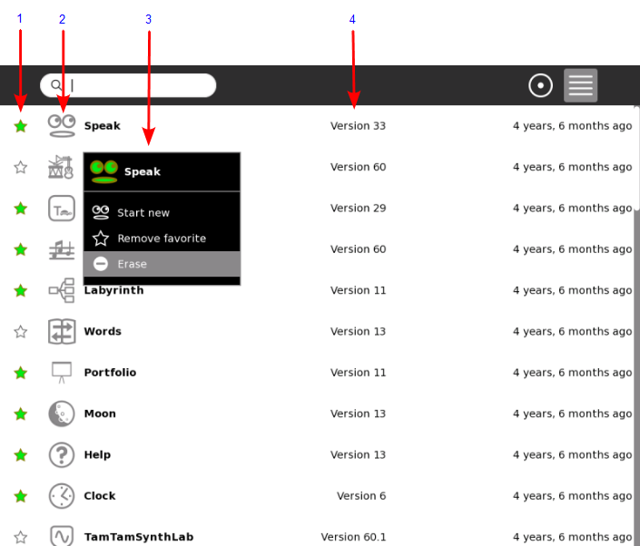
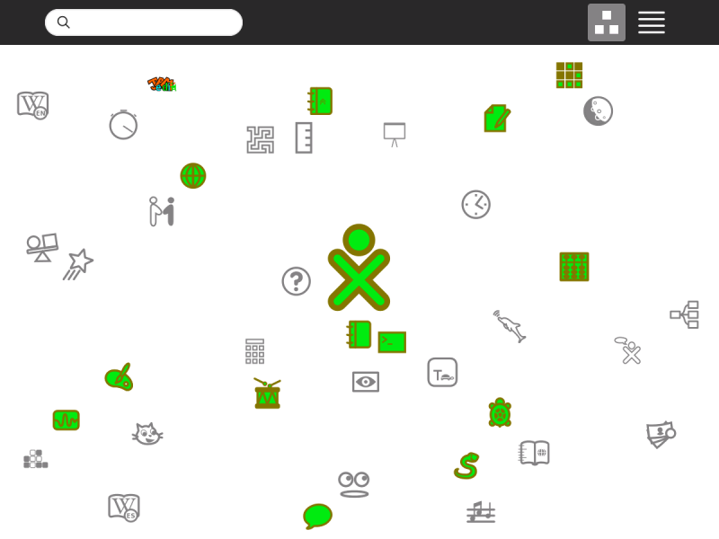
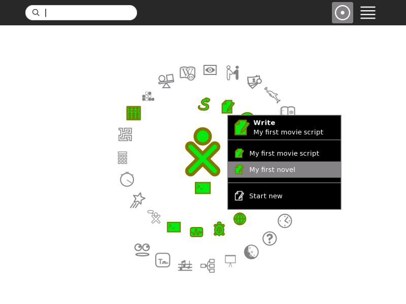
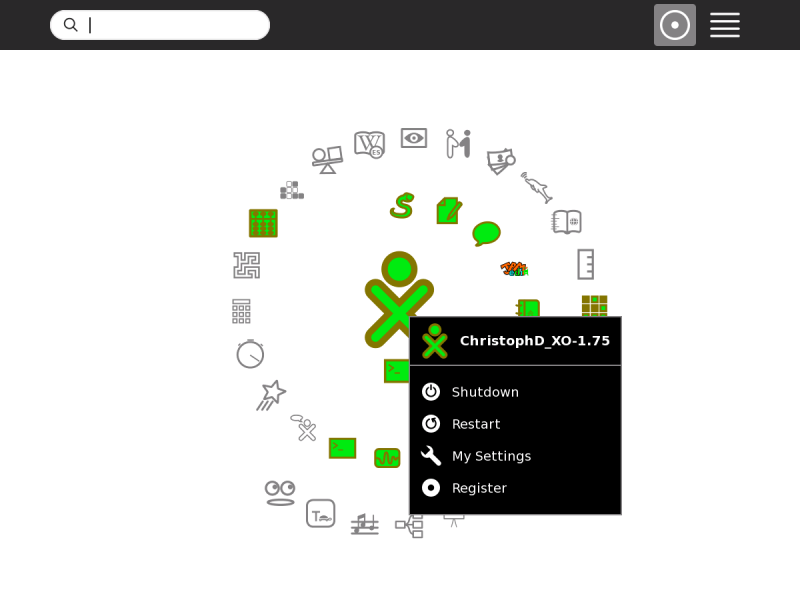
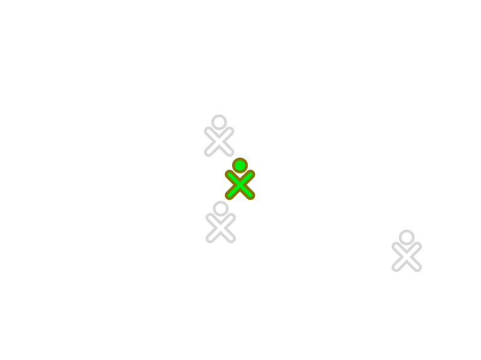
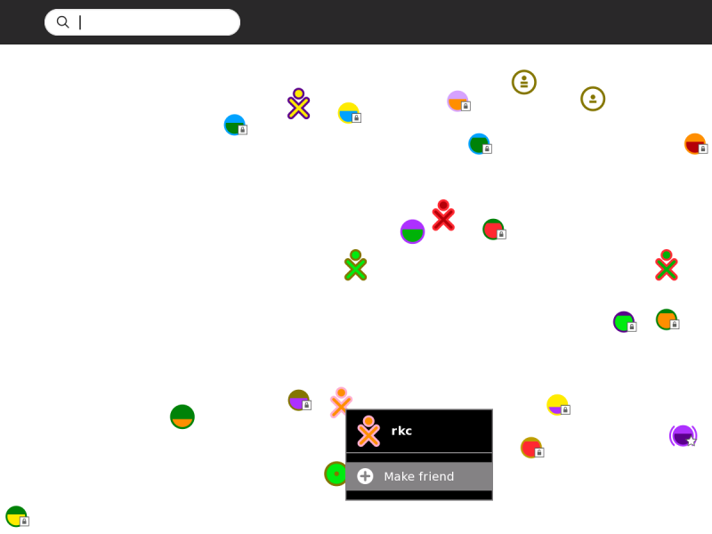
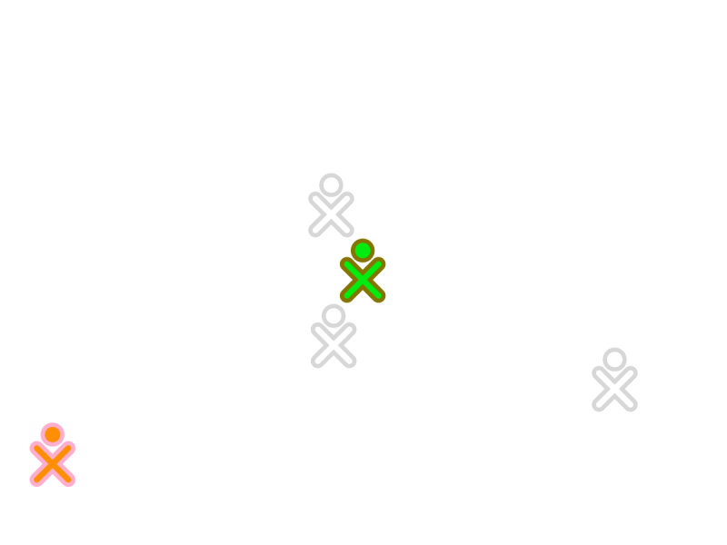
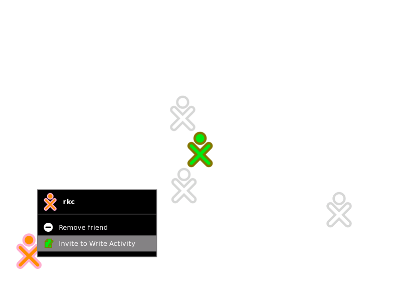
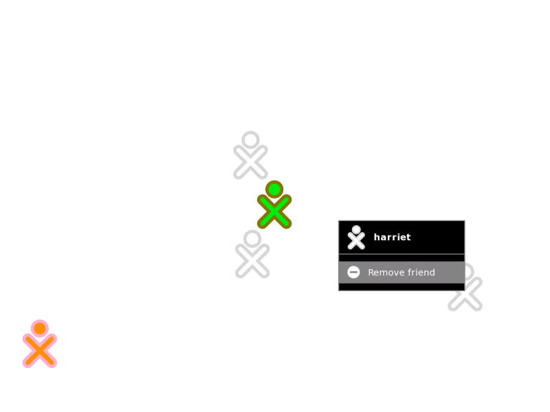

# Using Sugar

## Table Of Contents

## The Sugar User Interface
The Sugar platform encourages learning through personal expression.

The user interface differs from the traditional Desktop metaphor. It uses a “zooming” metaphor—each view represents a different scale of interaction. You move between a view of the network “neighborhood”, your “friends”, your “home page”, and your currently open application (“Activity”). Each view occupies the entire screen. There are no overlapping windows to deal with.

*With Sugar, you zoom between views: from your network neighborhood to your current Activity.*

Sugar supports sharing and collaboration by default. Sugar brings many of the rich collaboration mechanisms we are accustomed to from the Internet directly into the user interface. Sharing a file, starting a chat, collaborating in a writing exercise, or playing a game with other people are never more than a single click away.

Sugar incorporates a Frame around the border of the screen; the Frame holds status information, such as alerts, a clipboard, open activities, and your current collaborators.

Sugar maintains a Journal (or diary) of everything you do; it is a place for reflection. You do not need to save files or create folders; Activities automatically save your work to the Journal.

Sugar emphasizes discovery. Every object in the interface has a menu that reveals more details and options for action. Many Activities include a “view source” option; for example, the Browse activity lets you examine the HTML code that reveals how a web page is created. Most Activities are written in the Python scripting language. You can see how they work, and make changes to them.

Sugar has clarity of design. There is no need to “double click”. There are no overlapping windows. Sugar uses color and shape throughout the interface to provide a fun, expressive, approachable platform for computing.

### For Parents And Teachers
__Activities, not Applications__
  * Sugar does not have applications in the traditional sense. Activities are distinct from applications in what they focus on (collaboration and expression) and in their implementation (journaling and iteration). This is more than a new naming convention; it represents an intrinsic quality of the learning experience we hope the children will have when using Sugar.
  
__Presence is always Present__
  * Everyone has the potential for learning and teaching. Sugar puts collaboration at the core of the user experience in order to realize this potential. The presence of other learners encourages children to take responsibility for others’ learning as well as their own. The exchange of ideas amongst peers makes the learning process more engaging and stimulates critical thinking skills. Sugar encourages these types of social interaction with the laptops.
  * Most activities have the potential to become network enabled. For example, consider the Browse activity. With typical computer interfaces, you browse in isolation. In Sugar, sharing links is an integral part of Browse, transforming web-surfing into a group collaboration.
  
__Tools of Expression__
  * Sugar emphasizes thinking, expressing, and communicating using technology. Sugar starts from the premise that we want to use what people already know in order to make connections to new knowledge. Computation is a “thing to think with”. Sugar makes the primary activity of the children one of creative expression, in whatever form that might take. Most activities focus on the creation of some type of object, be it a drawing, a song, a story, a game, or a program. In another language shift describing the user experience, we refer to objects rather than files as the primary stuff of creative expression.
  * As most software developers would agree, the best way to learn how to write a program is to write one, or perhaps teach someone else how to do so. Studying the syntax of the language is useful, but it doesn’t teach one how to code. We apply the principle of “learning through doing” to all types of creation. For example, we emphasize composing music over downloading music. We also encourage the children to engage in the process of collaborative critique of their expressions and to iterate upon this expression as well.
  * Turning the traditional file system into objects speaks more directly to real-world metaphors: instead of a sound file, we have an actual sound; instead of a text file, a story. In order to support this concept, activity developers can define object types and associated icons to represent them.
  
__Journaling__
  * The concept of the Journal, a written documentation of everyday events, is generally understood, albeit in various forms across cultures. A journal typically chronicles the Activities one has done throughout the day. We have adopted a journal metaphor for the file system as our approach to file organization. The underlying implementation of the journal does not differ significantly from file systems in contemporary operating systems. The file system layout is less important than the journal itself.
  * The journal embodies the idea of storing a history of the things a child has done and the activities a child has participated in. The child, parent, and teacher can reflect on the journal to assess progress.
  * The Journal stores objects created while the student runs an Activity. This function is secondary, although important. The Journal naturally lends itself to a chronological organization. Objects in the Journal can be tagged, searched, and sorted by a variety of means. The Journal records what a child has done, not just what the child has saved. The Journal is a portfolio or scrapbook history of the child’s interactions with the machine and also with peers.
  * The Journal includes entries explicitly created by the children with entries that are implicitly created through the child’s participation in an Activities. Developers must think carefully about how an activity integrates with the Journal more so than with a traditional file system that functions independently of an application. The Activities, the objects, and the means of recording all tightly integrate to create a different kind of computer experience.

## Home View
Use the Home View to begin new Activities.
*Note: When you have clicked on an Activity’s icon, please wait for that Activity to start. If you get impatient and happen to click again on the Activity’s icon, you may end up with that Activity being started twice. When you click on an Activity’s icon, you will see a start-up view while that Activity initializes. Once the Activity is running, you will be placed into its Activity View. If the Activity fails to start, you will instead be returned to Home View.*

To get to the Home View, click the Home icon on the Frame or press the F3 key. The Home View has several modes. Each mode has a different arrangement of Activities:
  * Your favorite Activities in a ring (Ring View)
  * Your installed Activities in a list (List View)
  * Your favorite Activities arranged freeform (Freeform View)
  
### Ring View

1. Search box: Use the search box to find Activities. Note: If in List view you see fewer Activities than expected, you may need to click on the small X at the right end of the search box to undo an unintended search request.
2.Favorites modes: Click an icon to switch to a different view. Hover over the Favorites icon to see a menu that lets you pick Ring mode or Freeform mode.
3. List view: Click the icon to switch over to the List view.
4. Activity icon: Click an Activity icon to launch that Activity. Its icon is colored if the Activity has been used before and clicking on it will resume its last session. (Please see the Activity Menu section below for further information.) Only Activities that have been “starred” as favorites in the List View appear in this view.
5. Active Activity icon: The icon of the currently active Activity appears under the XO icon.
6. XO icon: Hover the pointer over the “XO” in the center of the Home View to bring up a menu and to access the Sugar Control Panel (Please see the chapter on Customizing Sugar).

When a search is done the Activities which don’t correspond to the result are greyed out. If only one Activity matches the search, the full name will replace what has been typed, and pressing enter will launch the Activity.

### List View

Use the List view to manage all of your Activities and to choose which Activity icons will appear on the Favorites view.
1. Activity favorite icon: A star, which is colored for favorite Activities, which appear in the Ring mode or Freeform mode. Click a star to color or clear it.
2. Activity icon: Click the icon to launch the Activity or hover over it to see the corresponding menu.
3. Hover menu: In this menu you can also launch, favorite and un-favorite Activities and erase them.
4. Version number: Here you can see which version of the Activity is currently installed. For more information about updating your Activities to the latest version please refer to the How to Install and Update Activities section.

### Freeform View

The Freeform mode of the Home View works the same as the Ring mode, but the icons are arranged arbitrarily instead of in a circle. You can drag the icons in this View to visually group them in a way that makes sense to you.

### Activity Menu

When hovering over an Activity icon a corresponding menu appears. From there you can directly resume the last few Activity sessions or choose to start a new one.

### XO Menu

Use the hover menu that appears over the XO icon to access the Sugar Control Panel and to shutdown or restart the computer.

## Neighborhood View
You can use the Neighborhood View to connect to the Internet and to collaborate with others.

To see the Neighborhood View, click the Neighborhood icon on the Frame. You can also use the Neighborhood button for this purpose if your keyboard has one, or press the F1 key.

### Neighbourhood Elements

1. Search menu: You can find find people, Activities, or access points (what connects you to the Internet) using the search menu.
2. Ad-Hoc network icon: An ad-hoc network lets you connect to other computers without using an access point.
3. Access point: WiFi hot spots (Internet access points) appear as circles in the Neighborhood view. If you hover over a circle, the name of the network appears. Each circle has another color inside, the more full the inside color, the better the connection. To connect to a network, click the circle, and then click Connect. If the circle shows a lock symbol, expect to enter a key or password. The inside of the circle blinks while your system tries to connect. Once you are connected, an icon for the connection will appear at bottom right of the Frame. To disconnect, hover over the circle, and choose Disconnect on the menu. Or hover over the icon in the Frame, and choose Disconnect there. (OLPC XO-1 Note: The XO-1 laptop has three mesh network channels. By clicking on a mesh icon, then clicking on Connect, you join that particular mesh network, and disconnect from an Access point network. The other XO icons shown will change according to who is on that network.)
4. Shared Activities: Shared Activities appear as icons in the Neighborhood View and you can join them by clicking the corresponding icon.
5. XO icon: Other Sugar users appear as XO icons. By hovering over them, you can discover the nickname of that person and can add them as a friend or invite them to join you in a shared Activity.
6. Open access point: An access point which isn’t protected by a password. The network behind the access point may still have a password.
7. Connected networks: Once the computer has connected to a network, two arcs are drawn either side of the icon.

## Group View
The Group View shows you, your friends and allows you to easily interact with them.

To show the Group View, click the Group icon on the Frame or press the F2 key.

The Group View shows you and your friends. XO icons that are dimmed represent friends who are currently offline.

### Adding Friends
You can add friends to the Group View from the Neighborhood View.

When you hover over an XO icon, the Make friend menu option appears. Click this option to add that person as a friend.

Your new friend’s icon then appears in the Group View.

### Inviting Friends
From the hover menu, you can also invite friends to join your current Activity. There is more information about invitations and sharing in the Collaborating chapter.

### Removing Friends
You can remove a friend from the Group View using the hover menu. Click Remove friend. That person’s icon disappears from the Group View.

## The Frame

## Journal

## My Settings

## Sugar Features

## GNOME

## XS school server
